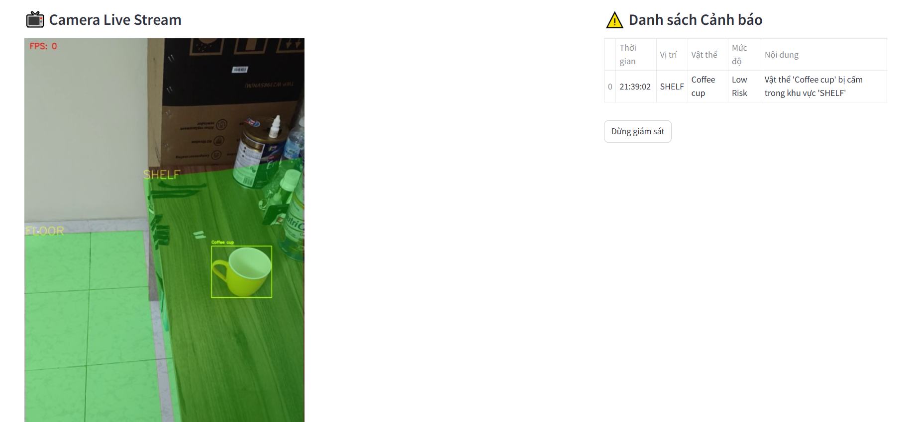

# 🛡️ Smart Child Room Safety Monitor (Đồ án môn Tư duy trí tuệ nhân tạo-AI002)

[](https://www.python.org/)
[](https://streamlit.io/)
[](https://github.com/ultralytics/ultralytics)
[](LICENSE)

> **Hệ thống giám sát an toàn trẻ em thông minh sử dụng AI để phát hiện vật thể nguy hiểm theo vùng (Zone-based Detection).**

## 📖 Giới thiệu (Introduction)

**AI002_SmartChildRoom** là giải pháp Computer Vision nhằm giải quyết vấn đề tai nạn thương tích ở trẻ em trong không gian gia đình. Hệ thống sử dụng **YOLOv8x-oiv7** để nhận diện vật thể và thuật toán hình học để xác định vị trí vật thể trong các vùng cảnh báo (Sàn nhà, Kệ tủ, v.v.).

Hệ thống không chỉ phát hiện vật thể (như dao, kéo) mà còn phân tích **ngữ cảnh**:
* *Kéo ở trên bàn:* An toàn (hoặc rủi ro thấp).
* *Kéo rơi trên sàn nhà:* **NGUY HIỂM CAO** -> Cảnh báo ngay lập tức.

## 📸 Demo Preview

Dưới đây là hình ảnh thực tế hệ thống hoạt động với giao diện Streamlit:




## ✨ Tính năng chính (Key Features)

* **⚡ Real-time Detection:** Xử lý video thời gian thực với tốc độ cao sử dụng YOLOv8.
* **📐 Zone-based Logic:** Định nghĩa các vùng an toàn/nguy hiểm bằng đa giác (Polygon Zones) tùy chỉnh (Sàn nhà, Khu vực chơi, Kệ thuốc...).
* **🚨 Contextual Alerts:** Hệ thống quy tắc (Rule Engine) thông minh:
    * **High Risk:** Vật sắc nhọn (dao, kéo, khoan) nằm trên sàn nhà.
    * **Medium Risk:** Đồ dễ vỡ (cốc, bình hoa) ở mép bàn/kệ thấp.
    * **Low Risk:** Đồ có nguy cơ gây nguy hiểm
* **🖥️ Dashboard trực quan:** Giao diện web Streamlit hiển thị video stream, vẽ vùng cảnh báo và nhật ký vi phạm (Log).
* **☁️ GPU Acceleration:** Tối ưu hóa để chạy trên CPU/GPU
## 🛠️ Cài đặt (Installation)

### Yêu cầu tiên quyết
* Python 3.10+
* GPU (Khuyên dùng để đạt FPS tốt nhất)

### Các bước cài đặt

1.  **Clone repository:**
    ```bash
    git clone [https://github.com/VanDinh-github/AI002_SmartChildRoom.git](https://github.com/VanDinh-github/AI002_SmartChildRoom.git)
    cd AI002_SmartChildRoom
    ```

## 🚀 Hướng dẫn sử dụng (Usage)

### 1. Chạy DOCKER trên máy cục bộ (Localhost)
```bash
docker build -t smartchildroom .
docker run -it --rm -p 8501:8501 smartchildroom

